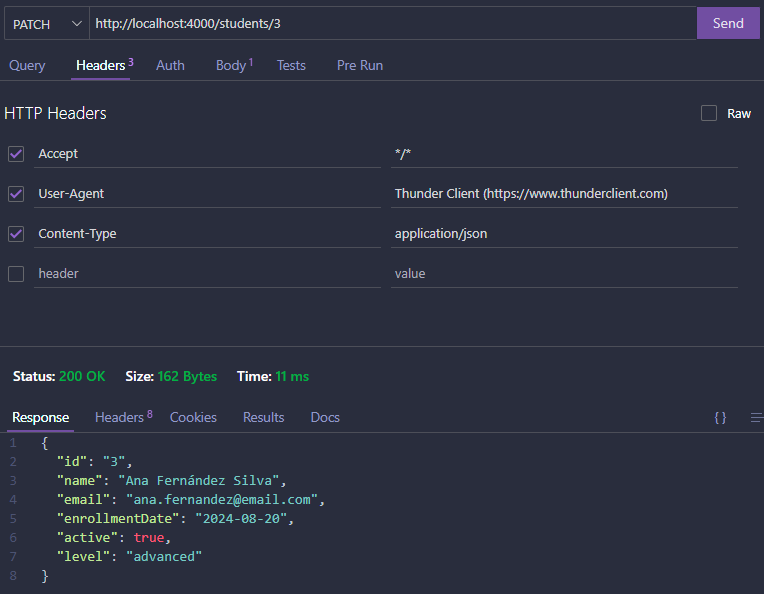
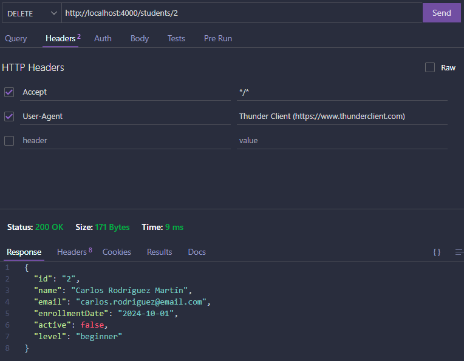

## Documentación CRUD con cURL

### CREATE: Crear un estudiante con POST

```bash
curl -i -X POST http://localhost:4000/students \
  -H "Content-Type: application/json" \
  -d '{"name":"Laura Gomez","age":23,"course":"Web","active":true}'
```

- -i -> para mostrar headers de respuesta.
- -X POST-> fuerza el método HTTP POST (crear un recurso).
- -H -> indica que el body es JSON.
- -d -> datos que se envían en el cuerpo de la petición.

#### ¿Por qué POST?

Se usa para crear recursos nuevos en una colección. JSON-Server genera un nuevo id automáticamente si no se proporciona.

#### Headers enviados:

- Content-Type: application/json -> es necesario para que el servidor interprete correctamente el JSON del cuerpo.

#### Respuesta obtenida:

```bash
HTTP/1.1 201 Created
X-Powered-By: tinyhttp
Access-Control-Allow-Origin: *
Access-Control-Allow-Methods: GET, HEAD, PUT, PATCH, POST, DELETE
Access-Control-Allow-Headers: content-type
Content-Type: application/json
Date: Wed, 08 Oct 2025 17:16:57 GMT
Connection: keep-alive
Keep-Alive: timeout=5
Content-Length: 95

{
  "id": "a323",
  "name": "Laura Gomez",
  "age": 23,
  "course": "Web",
  "active": true
}
```
Se crea correctamente (201 Created) y nos aparece el.

#### Petición y respuesta (Thunder Client)
.png)

### READ ALL: Leer todos los estudiantes con GET.

```bash
curl -i -X GET http://localhost:4000/students
```

- -i -> para mostrar headers de respuesta.
- -X GET -> recupera recursos.


#### ¿Por qué GET?

GET se utiliza para obtener recursos sin modificar el servidor.

#### Respuesta obtenida:

```bash
HTTP/1.1 200 OK
X-Powered-By: tinyhttp
Access-Control-Allow-Origin: *
Access-Control-Allow-Methods: GET, HEAD, PUT, PATCH, POST, DELETE
Access-Control-Allow-Headers: content-type
Content-Type: application/json
Date: Wed, 08 Oct 2025 19:02:22 GMT
Connection: keep-alive
Keep-Alive: timeout=5
Content-Length: 1394

[
  {
    "id": "1",
    "name": "María García López",
    "email": "maria.garcia@email.com",
    "enrollmentDate": "2024-09-15",
    "active": true,
    "level": "intermediate"
  },
  {
    "id": "2",
    "name": "Carlos Rodríguez Martín",
    "email": "carlos.rodriguez@email.com",
    "enrollmentDate": "2024-10-01",
    "active": false,
    "level": "beginner"
  },
  {
    "id": "3",
    "name": "Ana Fernández Silva",
    "email": "ana.fernandez@email.com",
    "enrollmentDate": "2024-08-20",
    "active": true,
    "level": "advanced"
  },
  {
    "id": "4",
    "name": "David Sánchez Torres",
    "email": "david.sanchez@email.com",
    "enrollmentDate": "2024-09-10",
    "active": true,
    "level": "intermediate"
  },
  {
    "id": "5",
    "name": "Laura Martínez Ruiz",
    "email": "laura.martinez@email.com",
    "enrollmentDate": "2024-09-25",
    "active": true,
    "level": "beginner"
  },
  {
    "id": "6",
    "name": "Javier López Gómez",
    "email": "javier.lopez@email.com",
    "enrollmentDate": "2024-07-15",
    "active": true,
    "level": "advanced"
  },
  {
    "id": "79eb",
    "name": "Sofía Ramírez Castro",
    "email": "sofia.ramirez@email.com",
    "enrollmentDate": "2024-10-07",
    "active": true,
    "level": "beginner"
  },
  {
    "id": "a323",
    "name": "Laura Gomez",
    "age": 23,
    "course": "Web",
    "active": true
  }
]
```
La petición se procesa correctamente y se devuelve el recurso solicitado (200 OK).

#### Petición y respuesta (Thunder Client)
.png)

### READ BY ID: Leer un estudiante por ID con GET.

```bash
curl -i -X GET http://localhost:4000/students/3
```
- -i -> para mostrar headers de respuesta.
- -X GET -> método GET para obtener el recurso /estudents/3.

#### Respuesta obtenida:

```bash
HTTP/1.1 200 OK
X-Powered-By: tinyhttp
Access-Control-Allow-Origin: *
Access-Control-Allow-Methods: GET, HEAD, PUT, PATCH, POST, DELETE
Access-Control-Allow-Headers: content-type
Content-Type: application/json
Date: Wed, 08 Oct 2025 19:07:18 GMT
Connection: keep-alive
Keep-Alive: timeout=5
Content-Length: 162

{
  "id": "3",
  "name": "Ana Fernández Silva",
  "email": "ana.fernandez@email.com",
  "enrollmentDate": "2024-08-20",
  "active": true,
  "level": "advanced"
}
```

El recurso ha sido encontrado y devuelto (200 OK).

#### Petición y respuesta (Thunder Client)
.png)

### UPDATE: Reemplazar un estudiante con PUT.

```bash
curl -i -X PUT http://localhost:4000/students/3 \
  -H "Content-Type: application/json" \
  -d '{"id":3,"name":"Luis Medina","age":30,"course":"JavaScript","active":true}'
```

- -i -> para mostrar headers de respuesta.
- -X PUT -> método PUT para el  reemplazo.
- -H -> indica formato JSON.
- -d -> cuerpo con el objeto completo que reemplaza al existente.

#### ¿Por qué PUT?

Porque nos permite reemplazar un recurso completo.

#### Respuesta obtenida:

```bash
HTTP/1.1 200 OK
X-Powered-By: tinyhttp
Access-Control-Allow-Origin: *
Access-Control-Allow-Methods: GET, HEAD, PUT, PATCH, POST, DELETE
Access-Control-Allow-Headers: content-type
Content-Type: application/json
Date: Wed, 08 Oct 2025 19:14:59 GMT
Connection: keep-alive
Keep-Alive: timeout=5
Content-Length: 97

{
  "id": "3",
  "name": "Luis Medina",
  "age": 30,
  "course": "JavaScript",
  "active": true
}
```

La actualización se ha realizado correctamente (200 OK).

#### Petición y respuesta (Thunder Client)
.png)

### PATCH: actualización parcial con PATCH

```bash
curl -i -X PATCH http://localhost:4000/students/3 \
  -H "Content-Type: application/json" \
  -d '{"active":false}'
```

- -i -> para mostrar headers de respuesta.
- -X PATCH -> PATCH se usa para modificar parcialmente.
- -H -> cuerpo en JSON.
- -d -> datos con los campos que queremos cambiar.

#### ¿Por qué PATCH?

Porque nos permite reemplazar los campos del objeto que queramos.

#### Respuesta obtenida:

```bash
HTTP/1.1 200 OK
X-Powered-By: tinyhttp
Access-Control-Allow-Origin: *
Access-Control-Allow-Methods: GET, HEAD, PUT, PATCH, POST, DELETE
Access-Control-Allow-Headers: content-type
Content-Type: application/json
Date: Wed, 08 Oct 2025 19:19:56 GMT
Connection: keep-alive
Keep-Alive: timeout=5
Content-Length: 98

{
  "id": "3",
  "name": "Luis Medina",
  "age": 30,
  "course": "JavaScript",
  "active": false
}
```

La actualización se ha realizado correctamente (200 OK).

#### Petición y respuesta (Thunder Client)


### DELETE: Eliminar un estudiante con DELETE

```bash
curl -i -X DELETE http://localhost:4000/students/3
```

- -i -> para mostrar headers de respuesta.
- -X DELETE -> método que nos sirve para borrar un recurso.

#### Respuesta obtenida:
```bash
HTTP/1.1 200 OK
X-Powered-By: tinyhttp
Access-Control-Allow-Origin: *
Access-Control-Allow-Methods: GET, HEAD, PUT, PATCH, POST, DELETE
Access-Control-Allow-Headers: content-type
Content-Type: application/json
Date: Wed, 08 Oct 2025 19:23:11 GMT
Connection: keep-alive
Keep-Alive: timeout=5
Content-Length: 98

{
  "id": "3",
  "name": "Luis Medina",
  "age": 30,
  "course": "JavaScript",
  "active": false
}
```

La eliminación se ha realizado correctamente (200 OK).

#### Petición y respuesta (Thunder Client)
